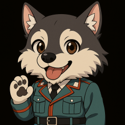
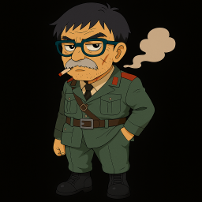

# First Shot（ファーストショット）

**First Shot（ファーストショット）** は、Python 向けのレトロゲームエンジン「Pyxel (ピクセル)」をメインに開発されたレトロスタイルのシューティングゲームです。  
本プロジェクトは、Pythonの学習を目的として制作されており、クラシックなピクセルアートやシンプルな操作性を特徴としています。 
制作者が初めて開発したゲームのため、「**First** Shot」と命名しました。

## 特徴

- **レトロなシューティングゲーム体験** – シンプルなシューティングゲームで、ドット絵と8bit風の音楽が魅力です。
- **複数ステージ＆ボス戦** – 3つのステージを収録しており、それぞれに個性的な敵や背景、ステージボスが登場します。
- **3人のプレイヤーキャラクター** – クラリーチェ、ロッキー、ゲンゾウの3人から操作キャラを選択可能。キャラごとに特殊能力があります。
- **レベルアップシステム** – 敵を倒して経験値を獲得し、ゲーム中にレベルアップすることで自機が強化されていきます。

## ゲームの始め方

- **ゲームダウンロード**：本リポジトリにある「firstshot.7z.001」と「firstshot.7z.002」をダウンロードしてください。
- **zipファイル解凍**：ダウンロードした2つのファイルを、任意のディレクトリ内に配置して解凍してください。
- **exeファイル実行**：解凍したfirstshotフォルダ内の「firstshot.exe」をダブルクリックすることで、ゲームが起動します。
- **アンインストール**：firstshotフォルダをそのまま削除してください。

## ゲームの流れ

- **ゲーム起動**：ゲームを開始すると、タイトル画面が表示されます。Enterでパイロット選択画面に進みます。
- **パイロット選択**：左右キーでキャラを選び、Enterで決定。
- **ステージ**：
  ステージ1からステージ3まであります。 
  各ステージの最後にBOSSが出現し、BOSSを倒すとステージクリアです。
- **ゲームクリア**：ステージ3のBOSSを倒すことでゲームクリアです。クリア後、ENTERでタイトル画面にもどります。

## 操作方法

| キー | 操作 |
|------|------|
| ←/→/↑/↓ | 自機の移動 |
| SPACE | ショットを発射 |
| SHIFT | オートショットモード切替 |
| S | SPスキル発動（クールタイム中は不可） |
| ENTER | タイトル画面からパイロット選択へ、または選択決定 |
| ←/→ | パイロット選択画面でキャラクターを切り替え |
| P | 一時停止|
| ESC | ゲームを終了(注意！確認なしですぐに終了します) |

## パイロット性能

各パイロットは固有のアビリティとスキルを持っています。ステージ攻略の方針に合わせて選択してください。
- **アビリティ** – ステージをプレイ中、常に効果を発揮します。
- **SPスキル** – ステージプレイ中にSキーを押下することで発動し、使用回数に制限があります。

### クラリーチェ

- 名門貴族のお嬢様パイロット
  - 普段はボンヤリしているが、戦闘時には驚異的な集中力を発揮する
- アビリティ：高速処理
  - ショットの連射速度が少し早い
- SPスキル：ゾーン
  - 一定時間、敵と敵弾の速度を遅くする

### ロッキー

- 食べるの大好きワンコパイロット
  - 給料はほとんど食事代に消えるらしい
- アビリティ：携帯食料
  - 初期ライフが少し高い
- SPスキル：ドッグラッシュ
  - 一定時間、特殊弾を追加発射する

### ゲンゾウ

- 何度も死線を潜り抜けてきた歴戦パイロット
  - 待機中はタバコを吸ってばかり
- アビリティ：歴戦の勘
  - 自機の当たり判定が小さい
- SPスキル：友軍支援
  - 一定時間、ミサイルで支援攻撃する

## ゲームTips

- 自機が被弾した時、敵の弾を全て消し、短時間無敵になります。
- 自機のレベルが上がると、ショットが追加され、連射速度も上昇します。
- SHIFTキーでオートショットモードを切り替えられます。

## ライセンスについて
© 2025 FanMaker777

本ゲームはPyxel（MITライセンス）を利用して開発されましたが、
ゲーム自体の著作権およびコンテンツは作者に帰属します。

【利用条件】
- 営利目的での利用（販売、広告付き配信など）は禁止します。
- 改変、再配布は禁止します。
- 教育・個人利用に限り、無料でプレイ可能です。

【Pyxelについて】 
本ゲームはPython向けレトロゲームエンジン「pyxel」をメインに開発しました。
PyxelはMIT ライセンスのオープンソースです。
https://github.com/kitao/pyxel/blob/main/LICENSE

## 素材の著作権について
- ゲーム内の音楽は以下のサイトからお借りしました。
  - BGM：魔王魂
  - SE：効果音ラボ
  - SE：効果音工房
  - SE：OtoLogic(https://otologic.jp)(CC BY 4.0)

## 謝辞
- [Pyxel] – 簡単にレトロゲームを作成できる素晴らしいライブラリ
- オープンソースの情報 – ゲームループや当たり判定など多くの知見を学習に活用しました
